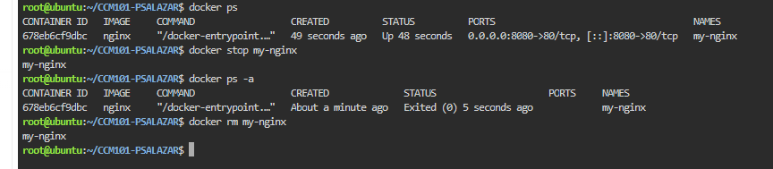

# Docker Deployment Log

## Commands Used and What They Did

1. `docker ps` – Lists all currently running containers.
2. `docker stop my-nginx` – Stops the running Nginx container.
3. `docker ps -a` – Lists all containers, including stopped containers, to confirm that `my-nginx` has an "Exited" status.
4. `docker rm my-nginx` – Removes the stopped container from the system.

