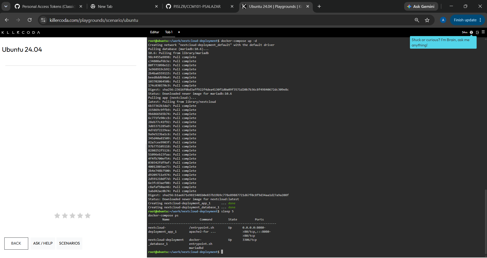
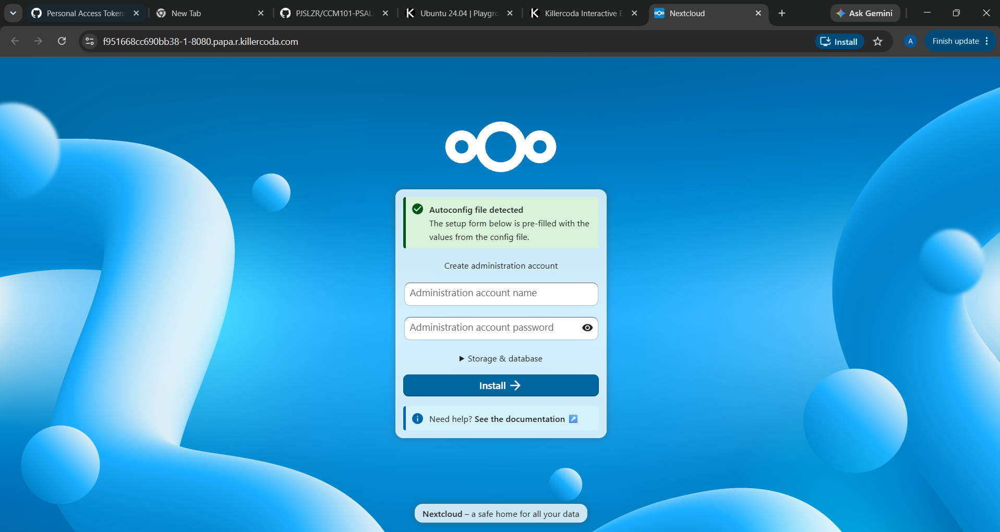
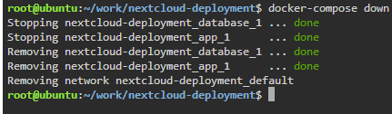

# Docker Compose Deployment Guide

## The `services:` Block

The `services:` block defines every container that makes up the application stack. Each entry underneath it (`database`, `app`) describes one container: which image to use, what ports to expose, and what environment variables to set. Docker Compose reads this block and creates, starts, and networks all the listed containers together with a single command.

## How the App Container Finds the Database

The `app` service's `MYSQL_HOST=database` environment variable points it at the database container. Docker Compose automatically creates a private network for the stack and registers each service's name (`database`, `app`) as a DNS hostname on that network, so the Nextcloud container can resolve `database` to the MariaDB container's internal IP without any manual network configuration.

## `docker run` vs `docker-compose up -d`

`docker run` starts one container at a time from a single command, and connecting multiple containers manually requires separate `docker network` and `docker run --link` commands for each one. `docker-compose up -d` reads a single YAML file describing the entire multi-container stack — images, ports, environment variables, and networking — and creates and starts every container together in one step, which is the core idea of Infrastructure as Code.

## Compose File Used

```yaml
version: '3'

services:
  database:
    image: mariadb:10.6
    environment:
      - MYSQL_ROOT_PASSWORD=cloudnova_root
      - MYSQL_PASSWORD=cloudnova_pass
      - MYSQL_DATABASE=nextcloud_db
      - MYSQL_USER=nextcloud_user

  app:
    image: nextcloud
    ports:
      - 8080:80
    environment:
      - MYSQL_PASSWORD=cloudnova_pass
      - MYSQL_DATABASE=nextcloud_db
      - MYSQL_USER=nextcloud_user
      - MYSQL_HOST=database
```

## Evidence






